# Chapter 2: Mutual Exclusion - Reflections

## Overview
Mutual exclusion is the most common coordination pattern in multiprocessor programming. The chapter presents classical algorithms (rarely used in production) that help build intuition - and would have been useful for the ["philosophers" in Chapter 1](https://medium.com/@ironengineer/the-dijkstras-dinner-party-that-explains-concurrency-e8a06c469d07?sk=367f8d0dbd91551f96a479d0c0be241d).

A critical section is the part of code where processes access shared memory. Only one process may execute it at a time.

## Lock Usage Pattern
A lock enforces mutual exclusion:
- `lock.acquire()` → enter critical section
- `lock.release()` → exit critical section

```java
lock.lock();
try {
    // critical section
} finally {
    lock.unlock(); // release even if an exception occurs
}
```

## Core Properties of a Lock

1. **Mutual Exclusion** – at most one thread inside the critical section
2. **Deadlock Freedom** – if threads want in, some will eventually succeed
3. **Starvation Freedom (Fairness)** – every waiting thread will eventually succeed

*Assumes only atomic reads/writes (no hardware primitives yet).*

## The Waiting Room (Doorway Section)

Every algorithm defines a short doorway section:
- Code a thread executes before it officially "waits in line"
- Must finish in a bounded number of steps (cannot block)

### Why it matters:
- Prevents ambiguity about who arrived first
- Ensures fairness properties can even be reasoned about
- Without a doorway, "first-come-first-served" is meaningless because multiple threads may overlap arbitrarily at the start


## Two-Thread Algorithms

### Lock 1 
One thread spins until the other leaves.
❌ Can deadlock if both wait.

### Lock 2 
Each thread signals intention.
❌ Can starve if the other never proceeds.

### Peterson's Lock 
Combines both approaches.
✅ Correct and elegant for two threads.

```java
// Peterson's Lock for thread i (0 or 1)
flag[i] = true;    // doorway: announce intent
turn = j;          // doorway: give priority
while (flag[j] && turn == j) {
    // waiting room
}
// critical section
flag[i] = false;
```

## Extending to Many Threads

### Filter Lock
Generalizes Peterson's Lock to n threads. Picture an n-story building: each "floor" filters out one more thread until only one reaches the top.

✅ Works for many threads  
❌ No fairness guarantee

```mermaid
graph TD
  A[Floor 1: n threads] --> B[Floor 2: n-1 threads]
  B --> C[Floor 3: n-2 threads]
  C --> D[...]
  D --> E[Top Floor: 1 thread → Critical Section]
```



## Adding Fairness

**Fairness**: if one thread arrives before another, it should enter first.

### Lamport's Bakery Algorithm:
- **Doorway** = take a numbered ticket
- **Waiting room** = compare tickets
- Lowest number goes first; ties broken by ID

✅ Ensures fairness  
❌ Ticket numbers grow without bound → overflow risk

```mermaid
sequenceDiagram
    participant T1 as Thread 1
    participant T2 as Thread 2
    participant T3 as Thread 3
    Note over T1,T3: Doorway = take ticket
    T1->>Lock: Ticket #5
    T2->>Lock: Ticket #6
    T3->>Lock: Ticket #7
    Note over T1: First in line → enters critical section
```



## Handling Overflow

Bounded timestamps solve overflow by allowing numbers to wrap around while keeping order consistent. Uses precedence graphs, which are trickier to reason about than earlier algorithms.

## Why This Chapter Matters

- The **doorway/waiting room concept** is critical: without it, fairness can't be defined
- Practicing Peterson's and Bakery locks was fun; later material (bounded timestamps, precedence graphs) stretched my understanding
- These "toy" algorithms reveal the core challenges of concurrency and motivate why real systems need hardware primitives (e.g., test-and-set, compare-and-swap)

## 👉 Big Takeaway

Chapter 2 shows not only how to achieve exclusion but also what it means to be fair, bounded, and practical. The **"waiting room"** is the foundation for reasoning about first-come-first-served.
